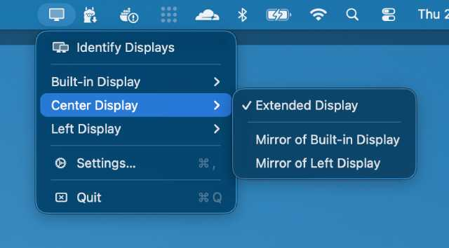
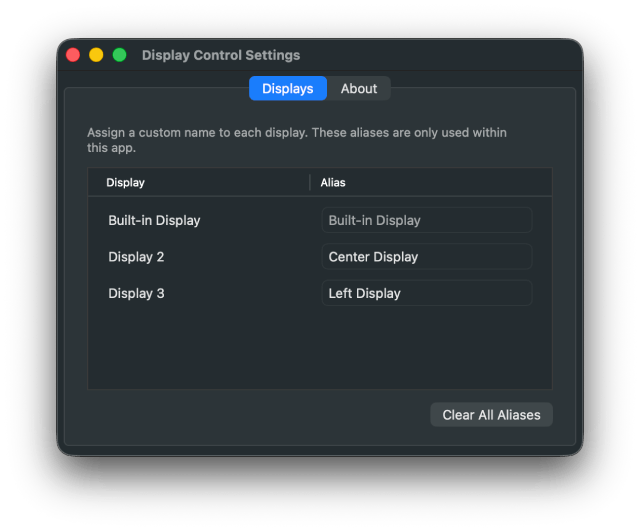

# Display Control

A lightweight macOS menu bar app for managing connected displays. Quickly switch between extended and mirrored displays right from the menu bar.

## Screenshots




## Requirements

- macOS 12.0+
- Xcode 14+

## Building

```bash
cd osx-display-control

xcodebuild -project DisplayControl.xcodeproj \
  -scheme DisplayControl \
  -configuration Release build \
  CODE_SIGN_IDENTITY="" \
  CODE_SIGNING_REQUIRED=NO \
  CODE_SIGNING_ALLOWED=NO \
  SYMROOT="$(pwd)/build"
```

The compiled app will be output to `build/Release/DisplayControl.app`.

## Running

After building, double-click **`build/Release/DisplayControl.app`** in Finder, or run:

```bash
open build/Release/DisplayControl.app
```

Or open `DisplayControl.xcodeproj` in Xcode and press **⌘R**.

## License

This project is licensed under the MIT License - see the [LICENSE](LICENSE) file for details.
